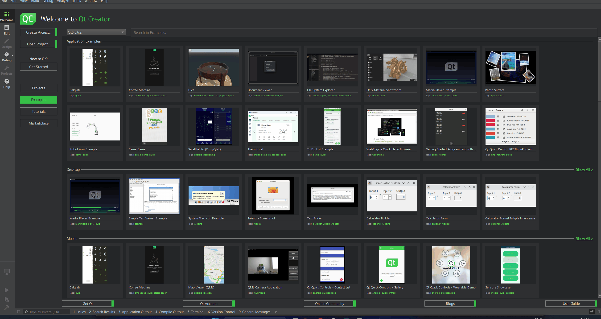

# Many Worlds

## About

* This repository contains a OpenGL / QT application where you can walk through portals, with each portal taking you to a new world, different from the original. The portal also previews the world you are about to be transported to.

## Showcase

* Note that each scene has an accompanying `.gif`, but it may take some time to load them on this page.

### Scene 0


* Here, we see a simple portal, where the cat inside the world is somewhat bigger.

### Scene 1


* Here, we see a world under some affine transformation. We support arbitrary affine transformations, when defining new worlds. In principle, you can even make a new transformation at runtime!

### Scene 2


* Here, we see a world being rendered with a different shader. We support arbitrary shader definitions, though such shader definitions must be present at compilation.

### Scene 3


* Here, we see that an arbitrary number of portals can be placed into a scene and each portal previews it's own respective world correctly.

### Home Portal Preview


* Here, we see that after entering a portal, all other portals preview (and take us back to) the home world.

## Requirements & Running

* OpenGL (>=3.3)
* Qt (>= 6.2)
* QtCreator (Optional)

### QtCreator

* Open `CMakeLists.txt` inside `QTCreator` and press the play button.

  

### `CMake`

* Make sure your shell's current directory is at the `src` directory.

* Run the following in your shell:

  ```bash
  mkdir build
  cd build
  cmake ..
  make
  ```

* Then run the executable that is created inside the build directory.


## Usage

* Movement is with the traditional `WASD` keys with some extras:
  * `WASD` for forward, left, backward and right movement.
  * `ZX` to hover up and down
  * `QE` to pan left and right
  * `RF` to tilt up and down
* To view scene `N`, change `MainView::currentScene` to be initialized to `Scene::createSceneN()`, where `N` is from `0` to `3`, in `mainview.h`.
* Moving through a portal places you inside that portal's world. Moving through any portal takes you back to the "home" (i.e: default) world.

## How does this work?

* The transformation itself is fairly simple, with `MainView::currentWorldEffectTransform` and `MainView::currentShaderType` holding the transformation.

  Upon collision with the portal, these are updated appropriately, to reflect the new world we move to (either the portal world or the home world).

* Movement involves setting a 60 FPS timer and capturing the keyboard input and updating `MainView::camera`. It creates a model transformation to be applied for other others.

* The real tricky stuff comes with rendering the portal preview. We use a stencil buffer and for each portal, run the shader. For each fragment shaded, the appropriate pixel in the stencil buffer get's set to the portal's id (essentially). Then for each portal, we render the world (after transformation) for the pixels in the stencil that are set to that portal's id.

  Finally, we render any pixel that is not set in the stencil for the current world we are in.

## Known Issues

* Currently, if there are objects within the world that are in front of the portal, the portal screen will render over it.
* There is a minor movement bug where after a 270 degree rotation, the left and right movement keys are swapped.
* The scene being rendered is hard-coded and defined at compile time.
* The code is not very pretty :pensive:

## Authors & Acknowledgements

This project was made as part of the submission to the end-of-course competition for [Computer Graphics, 2023/24](https://ocasys.rug.nl/current/catalog/course/WBCS019-05).

The authors are:

* [Channa Dias Perera](https://github.com/cdiasperera)
* [Robin Sachsenweger Ballantyne](https://github.com/MakeNEnjoy)

